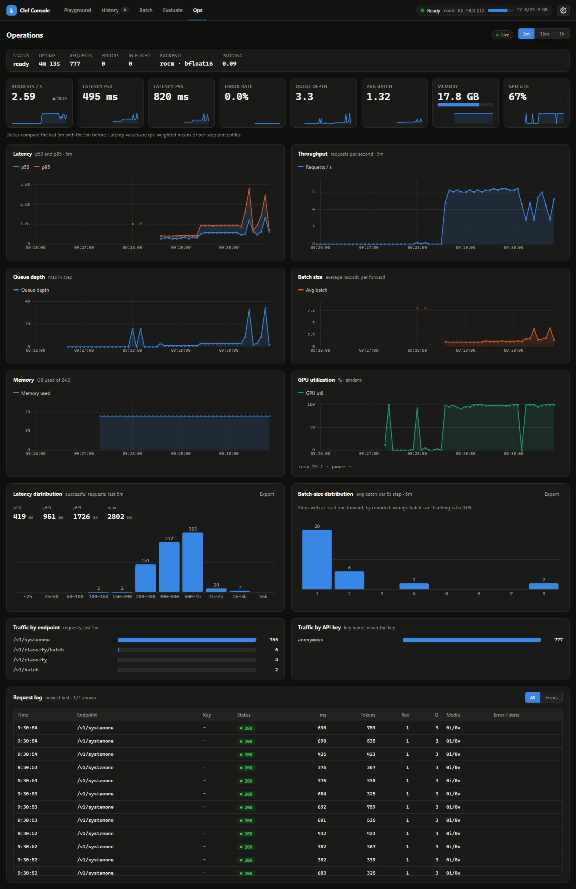
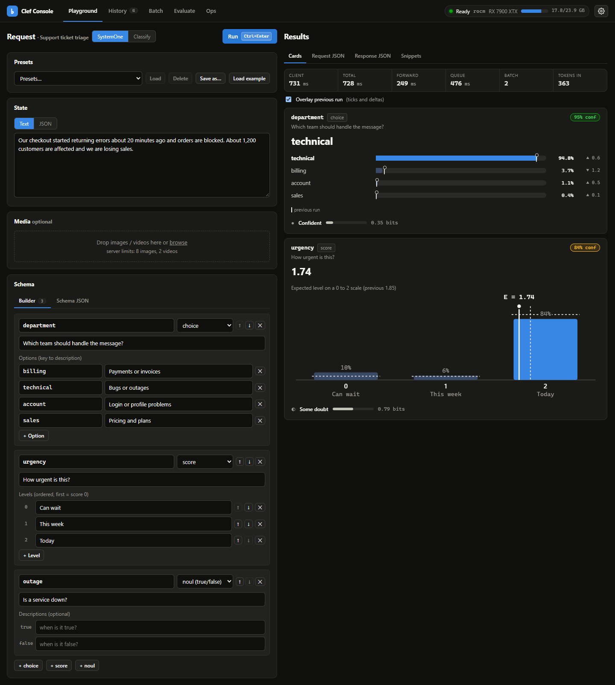
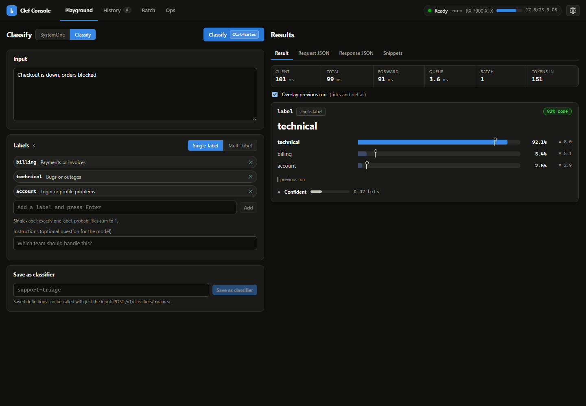
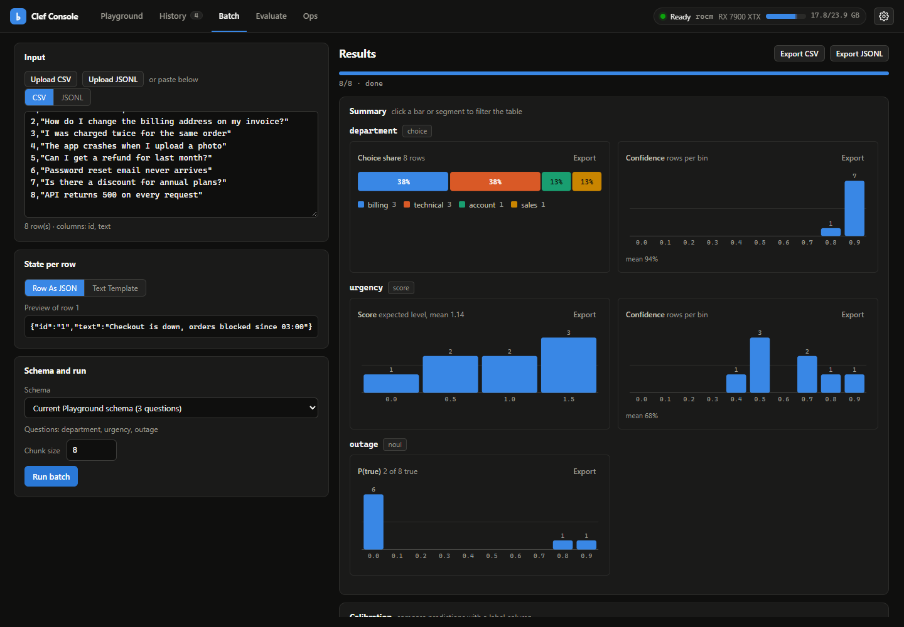
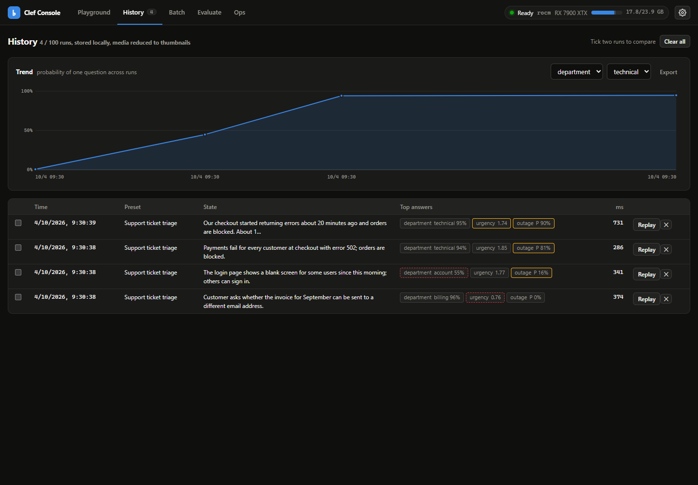

# clef

Run the Cloudflare [clef-flash](https://huggingface.co/Cloudflare/clef-flash) 9B multimodal **decision model**
(Qwen3.5-9B backbone + joint schema head) locally, behind a FastAPI server, a CLI, Python and JavaScript clients and
a web console.

It reads an input (text, JSON, images, videos) plus a set of options and returns a **calibrated probability for
every option in one forward pass**. No text generation, no parsing of free-form output.

```python
from clef_client import ClefClient

ClefClient().classify("Checkout is down", ["billing", "technical"])
# -> label='technical' confidence=0.96 scores={'billing': 0.04, 'technical': 0.96}
```

Runs on NVIDIA (CUDA), AMD (ROCm, also under WSL2), Apple Silicon (MPS) and CPU. Not every backend has been run on
real hardware yet; see the [support matrix](#support-matrix).

## Support matrix

| Platform | Backend | Status |
| --- | --- | --- |
| Windows + WSL2, AMD RX 7900 XTX | ROCm 7.2 | **verified** (development machine, all tests + benchmarks) |
| Ubuntu / Windows + WSL2, NVIDIA | CUDA | **untested on hardware** (code paths unit-tested with mocked backends) |
| macOS, Apple Silicon | MPS | **untested on hardware** (CI macOS runners have no MPS) |
| Any OS, no GPU | CPU | **verified in CI** (unit tests on Ubuntu, macOS, Windows; the model is not loaded in CI) |

"Untested on hardware" becomes "verified" only after a maintainer runs [docs/hardware-validation.md](docs/hardware-validation.md)
on a real machine and pastes the result into [docs/hardware-results.md](docs/hardware-results.md).

## Hardware requirements

The weights are ~19 GB in bf16 and peak device memory is ~19.5 GB (measured on ROCm).

| Setup | Memory | Notes |
| --- | --- | --- |
| NVIDIA / AMD GPU, bf16 | **24 GB VRAM** | the realistic floor |
| Apple Silicon, bf16 | **32 GB unified memory or more** | macOS 14+ for bf16 |
| NVIDIA 16 GB with `CLEF_QUANT=int8` or `nf4` | 16 GB VRAM | CUDA only (bitsandbytes). Accuracy and latency: pending hardware |
| CPU | ~40 GB RAM | works, but slow. Meant for development and tests |

Disk: ~19 GB for the weights plus ~21 GB free during `clef download`.

## Quick start

Everything below ends with the same three commands: `clef download` (one-time, ~19 GB), `clef serve`, then open
<http://127.0.0.1:8910/>. The recommended installer is [uv](https://docs.astral.sh/uv/); plain `pip` in a venv works
too. Pick the lock file that matches your hardware from `requirements/` (see `requirements/README.md`).

> Install commands assume the repo is cloned. Nothing is published to PyPI, so install from the checkout (or from the
> wheel on the GitHub Releases page).

One-line install without cloning (uv >= 0.8; `--torch-backend=auto` picks the CUDA / ROCm / CPU torch build for the
machine; swap the extra for `rocm`, `mps` or `cpu`):

```bash
uv tool install "clef-local[server,cuda] @ git+https://github.com/MiguelCarrascoB/clef" --torch-backend=auto
clef doctor && clef download && clef serve
```

### macOS (Apple Silicon)

```bash
git clone https://github.com/MiguelCarrascoB/clef && cd clef
uv venv --python 3.12 && source .venv/bin/activate
uv pip install -r requirements/macos.txt
uv pip install -e ".[server]"
clef doctor            # checks MPS, macOS version, memory, disk
clef download
clef serve
```

Needs macOS 14+ for bf16. `PYTORCH_ENABLE_MPS_FALLBACK=1` is set automatically; the fla Triton kernels do not run on
Mac, so the (fast enough) torch fallback is expected.

### Ubuntu + NVIDIA

Requires a current NVIDIA driver (`nvidia-smi` works). No CUDA toolkit is needed for the default install.

```bash
git clone https://github.com/MiguelCarrascoB/clef && cd clef
uv venv --python 3.12 && source .venv/bin/activate
uv pip install -r requirements/cuda.txt
uv pip install -e ".[server]"
clef doctor
clef download
clef serve
```

16 GB card: `CLEF_QUANT=nf4 clef serve` (or `int8`), after `uv pip install bitsandbytes`. See
[troubleshooting](docs/troubleshooting.md#cuda).

### Windows + WSL2, AMD ROCm (the verified setup)

Windows side: current Adrenalin driver, WSL2 with Ubuntu, `.wslconfig` from `deploy/wslconfig.sample`
(`memory=26GB` on a 32 GB host). Inside WSL:

```bash
sudo bash scripts/wsl_setup_root.sh      # ROCm + librocdxg (once)
bash scripts/wsl_setup_user.sh           # venv, model download
```

Then from PowerShell:

```powershell
.\clef.ps1 doctor
.\clef.ps1 start         # detached in WSL, keeps a hidden keep-alive session, waits until ready
.\clef.ps1 open          # http://localhost:8910/
.\clef.ps1 stop
```

Details and failure modes: [troubleshooting](docs/troubleshooting.md#rocm-under-wsl2).

### Windows + WSL2, NVIDIA CUDA

Install the NVIDIA Windows driver (it exposes the GPU to WSL; do not install a Linux driver inside WSL). Then follow
[Ubuntu + NVIDIA](#ubuntu--nvidia) inside the WSL distro and use `.\clef.ps1 start` from Windows if you want the
keep-alive wrapper. **Untested on hardware.**

### Docker

```bash
docker compose --profile cuda up -d     # NVIDIA, needs the NVIDIA container toolkit
docker compose --profile rocm up -d     # AMD, Linux host only
```

The compose file mounts a volume for the weights; download them once with
`docker compose --profile cuda run --rm clef-cuda clef download --yes` (or `--profile rocm ... clef-rocm`). Ports are
published on `127.0.0.1`; for LAN access set `CLEF_BIND=0.0.0.0` together with `CLEF_API_KEYS`. GPU containers on Docker Desktop for Windows/macOS
are not supported; use the WSL2 or native paths above.

### CPU only

```bash
uv venv --python 3.12 && source .venv/bin/activate        # Windows: .venv\Scripts\activate
uv pip install -r requirements/cpu.txt
uv pip install -e ".[server]"
clef download && CLEF_DEVICE=cpu clef serve
```

Expect seconds per record and ~40 GB of RAM. Use it for development, not for serving.

## CLI

| Command | What it does |
| --- | --- |
| `clef serve [--host --port --device --dtype --quant --model-path --detach --timeout]` | start the server (foreground; `--detach` writes a pidfile and waits until healthy) |
| `clef stop` / `clef status [--json]` / `clef logs [-f] [-n N]` | manage a detached server |
| `clef doctor [--no-gpu] [--smoke] [--json]` | environment checks per backend; `--smoke` loads the model and runs one record |
| `clef download [--revision SHA] [--dir DIR] [--yes]` | pinned, resumable download of the weights with a disk-space check |
| `clef bench [args]` | HTTP load test against the running server |
| `clef open` | open the console in the browser |
| `clef version` | print the version |

Config is `CLEF_*` environment variables (flags set the same variables). Table in
[docs/ARCHITECTURE.md](docs/ARCHITECTURE.md#configuration-configpy). Key ones: `CLEF_DEVICE` (`auto`),
`CLEF_DTYPE` (`auto`), `CLEF_QUANT`, `CLEF_MODEL_PATH`, `CLEF_HOST`, `CLEF_PORT`, `CLEF_API_KEYS`,
`CLEF_RATE_LIMIT`, `CLEF_STATE_DIR`.

## Classification API

`POST /v1/classify` is the short way to ask "which of these labels fits this input?". It runs on the same engine as
`/v1/systemone` and returns the same probabilities. Full guide: [docs/classification.md](docs/classification.md).
Machine-readable schema: [openapi.json](openapi.json) (also served at `/openapi.json`, interactive at `/docs`), so
you can generate a client in any language.

**curl**

```bash
curl -s http://127.0.0.1:8910/v1/classify -H 'Content-Type: application/json' \
  -d '{"input": "Checkout is down", "labels": ["billing", "technical"]}'
# {"label":"technical","confidence":0.96,"scores":{"billing":0.04,"technical":0.96}, ...}
```

**Python** (`from clef_client import ClefClient`; `AsyncClefClient` has the same methods)

```python
c = ClefClient("http://127.0.0.1:8910", api_key=None)

r = c.classify("Checkout is down", ["billing", "technical"])
r.label, r.confidence, r.scores  # 'technical', 0.96, {...}

# multi-label: every label whose P(true) >= threshold
c.classify("Refund me, the app also crashes", ["billing", "technical", "feature"], multi_label=True).labels

c.classify_many(["...", "..."], ["billing", "technical"])  # shared label set, results in input order
c.score("Server has been down for two hours", ["low", "medium", "high"]).score  # expected level index

c.classifier("support-triage").classify("My invoice is wrong")  # a saved classifier
```

**JavaScript** (Node 18+ and browsers, no dependencies; `clients/js`)

```js
import { ClefClient } from "./clients/js/src/index.js";

const c = new ClefClient({ baseUrl: "http://127.0.0.1:8910" });
const r = await c.classify("Checkout is down", ["billing", "technical"]);
console.log(r.label, r.confidence, r.scores);
await c.classifier("support-triage").classify("My invoice is wrong");
```

Saved classifiers (`PUT /v1/classifiers/{name}`) store labels and instructions on the server so callers send only the
input. More runnable examples are in `examples/` (curl, Python, JavaScript, PowerShell, a CSV classifier).

The original SystemOne API (`POST /v1/systemone`, `POST /v1/batch`, typed `choice` / `score` / `noul` questions, images
and videos) is unchanged; see [docs/ARCHITECTURE.md](docs/ARCHITECTURE.md).

## Remote access

Default bind is `127.0.0.1`: only the machine itself can call the server. To use it from other machines on your
network:

```bash
CLEF_HOST=0.0.0.0 CLEF_API_KEYS=~/.config/clef/keys CLEF_RATE_LIMIT=120 clef serve
```

Use named API keys and a firewall rule limiting the port to your LAN. Binding a non-loopback host without keys logs
a loud warning. For anything beyond a trusted LAN, put it behind a TLS reverse proxy (Caddy example included).
Details: [docs/remote-access.md](docs/remote-access.md).

## Console

`http://127.0.0.1:8910/` serves the Clef Console: Ops (live KPIs and time-series charts), Playground (SystemOne and
Classify modes), Batch (per-question charts, CSV/JSON in), History.

| | Light | Dark |
| --- | --- | --- |
| Ops |  |  |
| Playground |  |  |
| Classify |  |  |
| Batch |  |  |
| History |  |  |

Screenshots were taken against the live server on the RX 7900 XTX with `bench/http_bench.py` traffic
(`python scripts/screenshots.py`, Playwright + the installed Edge/Chrome). The v2 console, before the redesign, is in
`docs/screenshots/v2/`.

## Performance

Measured on the AMD RX 7900 XTX (ROCm 7.2, WSL2, bf16), the only GPU the project has been run on. Records of ~330
tokens, `clef bench`, 100 requests per level. v2 and v3 were run back to back on 2026-10-03 under the same conditions
(details: [docs/hardware-results.md](docs/hardware-results.md)):

| | v2 | v3 |
| --- | --- | --- |
| Single record p50 / p95 | 150.1 / 155.4 ms | 149.0 / 159.2 ms (2nd run 149.3 / 153.6) |
| Throughput, concurrency 1 | 6.6 req/s | 6.6-6.7 req/s |
| Throughput, concurrency 8 | 8.3 req/s | 8.1-8.2 req/s |
| Throughput, concurrency 16 (micro-batching) | 8.1 req/s | 8.8-8.9 req/s |
| Peak VRAM | ~19.5 GB | ~19.5 GB |

The model is **compute-bound**: GEMMs are ~83% of GPU kernel time at ~95 TFLOPS, so batching adds only ~30%
throughput. Single-record forwards spend ~50% of the time on host overhead; graph capture would remove most of it but
is blocked by a device sync in transformers' SDPA masking. Padding text batches to a multiple of 64 beats both raw
lengths and full buckets (`CLEF_PAD_MULTIPLE`); that was measured on ROCm only. NVIDIA, Mac and CPU numbers are
pending hardware.

Benchmarks: `clef bench` (HTTP, realistic), `bench/bench.py` (in-process, needs the GPU), `bench/profile_forward.py`
(torch.profiler), `bench/parity.py` (probability parity across dtypes and quantization).

## Development

```bash
uv venv --python 3.12 && source .venv/bin/activate
uv pip install -r requirements/cpu.txt         # or macos.txt
uv pip install -e ".[server,dev]"
pytest tests/unit
ruff check . && ruff format --check .
```

See [CONTRIBUTING.md](CONTRIBUTING.md). Architecture and API contract: [docs/ARCHITECTURE.md](docs/ARCHITECTURE.md).
Problems: [docs/troubleshooting.md](docs/troubleshooting.md), or run `clef doctor` first.

## Layout

```
src/clef_server/    FastAPI app, engine, backends, CLI, doctor, console (static/)
src/clef_client/    sync + async Python client
clients/js/         dependency-free JavaScript/TypeScript client
examples/           curl, Python, JavaScript, PowerShell, CSV classifier
requirements/       per-backend lock files (rocm, cuda, cpu, macos) and dev
docker/             Dockerfile.cuda, Dockerfile.rocm (+ docker-compose.yml at the root)
deploy/             systemd unit, launchd plist, Windows Task Scheduler snippet, WSL samples
scripts/            thin wrappers, WSL setup, openapi export
bench/              benchmarks and parity check
docs/               ARCHITECTURE, classification, remote-access, troubleshooting, hardware-*
```

## License

Apache-2.0, see [LICENSE](LICENSE). The model is Cloudflare clef-flash, also Apache-2.0 (base model Qwen/Qwen3.5-9B).
Security: [SECURITY.md](SECURITY.md).
