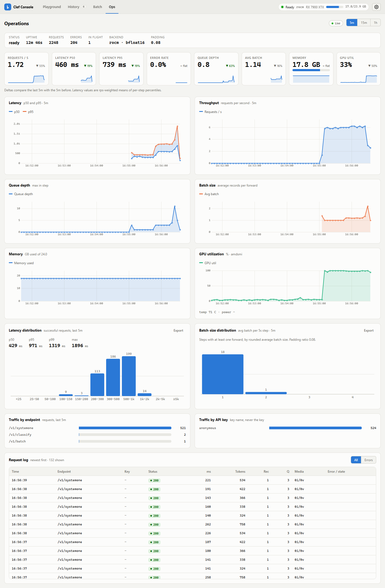
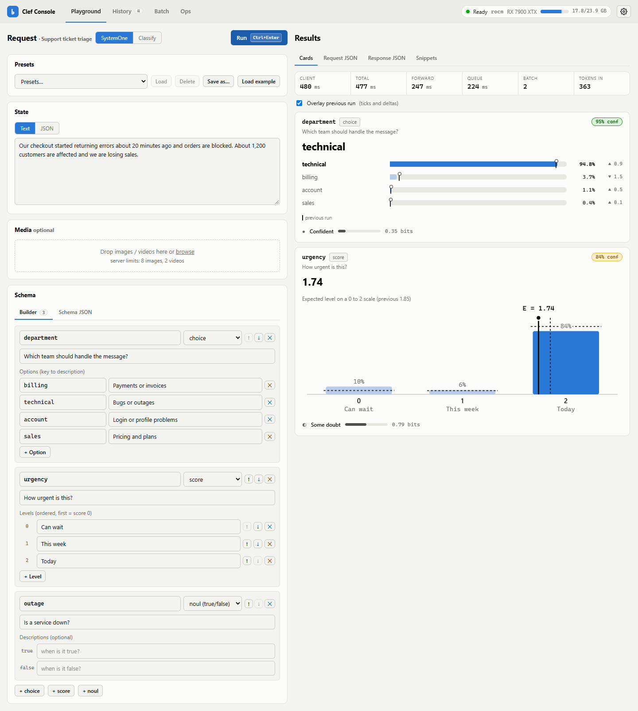
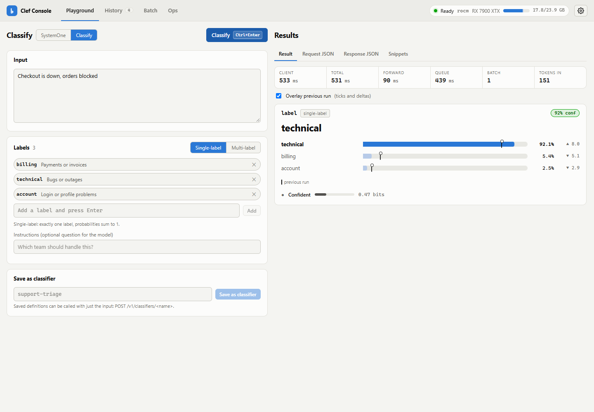
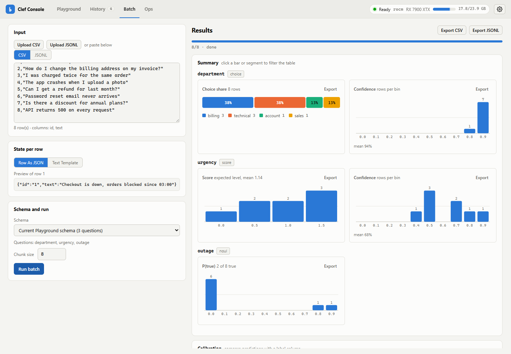
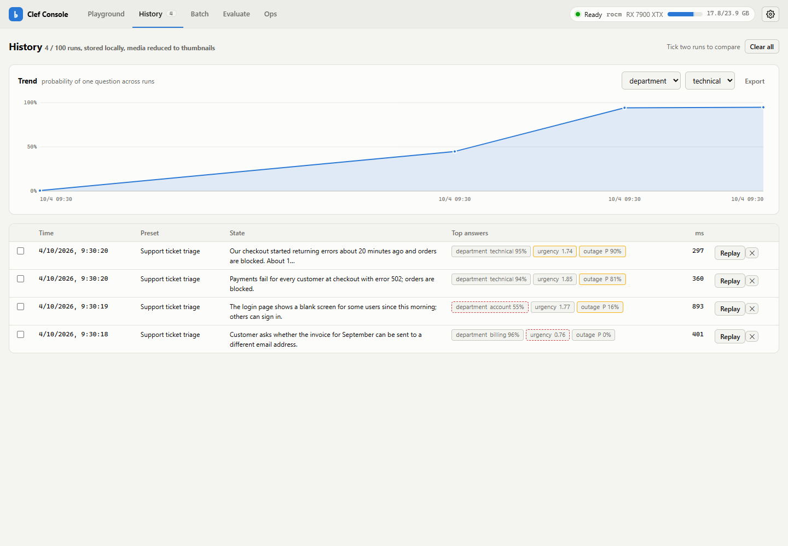

<div align="center">

# clef

**Calibrated, one-pass classification with a 9B multimodal model, running on your own GPU.**

Run Cloudflare's [clef-flash](https://huggingface.co/Cloudflare/clef-flash) decision model locally behind a FastAPI
server, a CLI, Python and JavaScript clients and a web console.

[](https://github.com/MiguelCarrascoB/clef/actions/workflows/ci.yml)
[](LICENSE)


[Quick start](#quick-start) · [Usage](#usage) · [Install](#installation) · [Console](#console) ·
[Performance](#performance) · [Docs](#documentation)

<picture>
  <source media="(prefers-color-scheme: dark)" srcset="docs/screenshots/ops-dark.png">
  
</picture>

</div>

---

## Why clef

clef-flash (Qwen3.5-9B backbone + joint schema head) reads an input (**text, JSON, images or video**) plus a set of
options and returns a **calibrated probability for every option in one forward pass**. It doesn't generate text, so
there is no free-form output to parse.

```python
from clef_client import ClefClient

ClefClient().classify("Checkout is down", ["billing", "technical"])
# -> label='technical' confidence=0.96 scores={'billing': 0.04, 'technical': 0.96}
```

- 🎯 **One call, every probability.** Single-label, multi-label, ordinal scores and typed multi-question batches.
- 🖼️ **Multimodal.** Text, JSON, images and videos in the same request.
- 💻 **Runs anywhere you have the memory.** NVIDIA (CUDA), AMD (ROCm, also under WSL2), Apple Silicon (MPS), CPU.
- 🧰 **Batteries included.** `clef` CLI, typed Python client (sync + async), zero-dependency JS/TS client,
  OpenAPI schema, Docker images and service files.
- 📊 **Clef Console.** Live KPIs and charts, a playground, batch runs and history at `http://127.0.0.1:8910/`.
- 🔒 **Local by default.** Loopback bind, named API keys, rate limiting, SSRF guard and input limits for LAN use.

> [!NOTE]
> clef is an independent project. It is not affiliated with or endorsed by Cloudflare; it runs their openly
> released clef-flash model.

## Quick start

> [!IMPORTANT]
> You need a **24 GB GPU** or a **Mac with 32 GB+ unified memory** (see [requirements](#hardware-requirements)),
> plus ~40 GB of free disk for the first download.

One-line install with [uv](https://docs.astral.sh/uv/) (>= 0.8). `--torch-backend=auto` picks the right torch build;
swap the `cuda` extra for `rocm`, `mps` or `cpu`:

```bash
uv tool install "clef-local[server,cuda] @ git+https://github.com/MiguelCarrascoB/clef" --torch-backend=auto
clef doctor      # checks the backend, memory and disk
clef download    # one-time, ~19 GB, pinned and resumable
clef serve       # then open http://127.0.0.1:8910/
```

Not on PyPI yet: install from git, from a clone (see [Installation](#installation)) or from a wheel on the GitHub
Releases page.

## Usage

`POST /v1/classify` answers the question "which of these labels fits this input?". Full guide:
[docs/classification.md](docs/classification.md). The schema is in [openapi.json](openapi.json) (also served at
`/openapi.json`, with interactive docs at `/docs`), so you can generate a client in any language.

<table>
<tr><th>curl</th><th>JavaScript (Node 18+ / browsers, no deps)</th></tr>
<tr><td>

```bash
curl -s http://127.0.0.1:8910/v1/classify \
  -H 'Content-Type: application/json' \
  -d '{"input": "Checkout is down",
       "labels": ["billing", "technical"]}'
# {"label":"technical","confidence":0.96,
#  "scores":{"billing":0.04,"technical":0.96}, ...}
```

</td><td>

```js
import { ClefClient } from "./clients/js/src/index.js";

const c = new ClefClient({ baseUrl: "http://127.0.0.1:8910" });
const r = await c.classify("Checkout is down",
                           ["billing", "technical"]);
console.log(r.label, r.confidence, r.scores);
```

</td></tr>
</table>

**Python** (`ClefClient`, and `AsyncClefClient` with the same methods):

```python
from clef_client import ClefClient

c = ClefClient("http://127.0.0.1:8910", api_key=None)

r = c.classify("Checkout is down", ["billing", "technical"])
r.label, r.confidence, r.scores  # 'technical', 0.96, {...}

# multi-label: every label whose P(true) >= threshold
c.classify("Refund me, the app also crashes", ["billing", "technical", "feature"], multi_label=True).labels

c.classify_many(["...", "..."], ["billing", "technical"])  # shared labels, input order
c.score("Server has been down for two hours", ["low", "medium", "high"]).score  # expected level index
c.classifier("support-triage").classify("My invoice is wrong")  # a saved classifier
```

| Endpoint | Use it for |
| --- | --- |
| `POST /v1/classify` | one input, single- or multi-label |
| `POST /v1/classify/batch` | many inputs, shared label set |
| `POST /v1/score` | ordinal scales (low / medium / high) |
| `PUT /v1/classifiers/{name}` | save labels and instructions server-side so callers send only the input |
| `POST /v1/systemone`, `POST /v1/batch` | the original SystemOne API: typed `choice` / `score` / `noul` questions, images and videos ([ARCHITECTURE](docs/ARCHITECTURE.md)) |

More runnable examples are in [`examples/`](examples/): curl, Python, JavaScript, PowerShell and a CSV classifier.

## Console

Open `http://127.0.0.1:8910/` to get the **Clef Console**. It has four screens: **Ops** (live KPIs and time-series
charts), **Playground** (SystemOne and Classify modes), **Batch** (CSV/JSON in, per-question charts) and **History**.

| Playground | Classify |
| --- | --- |
| <picture><source media="(prefers-color-scheme: dark)" srcset="docs/screenshots/playground-dark.png"></picture> | <picture><source media="(prefers-color-scheme: dark)" srcset="docs/screenshots/classify-dark.png"></picture> |
| **Batch** | **History** |
| <picture><source media="(prefers-color-scheme: dark)" srcset="docs/screenshots/batch-dark.png"></picture> | <picture><source media="(prefers-color-scheme: dark)" srcset="docs/screenshots/history-dark.png"></picture> |

<sub>Screenshots follow your GitHub theme. They were taken against the live server on an RX 7900 XTX with
`bench/http_bench.py` traffic (`python scripts/screenshots.py`). The pre-redesign v2 console is in
`docs/screenshots/v2/`.</sub>

## Platform support

| Platform | Backend | Status |
| --- | --- | --- |
| Windows + WSL2, AMD RX 7900 XTX | ROCm 7.2 | ✅ **verified** (development machine, all tests + benchmarks) |
| Any OS, no GPU | CPU | ✅ **verified in CI** (unit tests on Ubuntu, macOS, Windows; the model is not loaded in CI) |
| Ubuntu / Windows + WSL2, NVIDIA | CUDA | ⚠️ **untested on hardware** (code paths unit-tested with mocked backends) |
| macOS, Apple Silicon | MPS | ⚠️ **untested on hardware** (CI macOS runners have no MPS) |

A platform marked "untested on hardware" is promoted to "verified" once someone runs
[docs/hardware-validation.md](docs/hardware-validation.md) on a real machine and adds the result to
[docs/hardware-results.md](docs/hardware-results.md). **Have an NVIDIA card or a Mac? That is the most useful
contribution right now.**

### Hardware requirements

The weights are ~19 GB in bf16. Peak device memory is ~19.5 GB (measured on ROCm).

| Setup | Memory | Notes |
| --- | --- | --- |
| NVIDIA / AMD GPU, bf16 | **24 GB VRAM** | the realistic floor |
| Apple Silicon, bf16 | **32 GB unified memory or more** | macOS 14+ for bf16 |
| NVIDIA 16 GB with `CLEF_QUANT=int8` or `nf4` | 16 GB VRAM | CUDA only (bitsandbytes). Accuracy and latency not yet measured |
| CPU | ~40 GB RAM | works, but slow; meant for development and tests |

Disk: ~19 GB for the weights, and ~21 GB free while `clef download` runs.

## Installation

Every path ends the same way: `clef download` (once), `clef serve`, then open <http://127.0.0.1:8910/>. Pick the
lock file for your hardware from [`requirements/`](requirements/README.md). [uv](https://docs.astral.sh/uv/) is
recommended; plain `pip` in a venv also works.

<details>
<summary><b>🍎 macOS (Apple Silicon)</b></summary>

```bash
git clone https://github.com/MiguelCarrascoB/clef && cd clef
uv venv --python 3.12 && source .venv/bin/activate
uv pip install -r requirements/macos.txt
uv pip install -e ".[server]"
clef doctor            # checks MPS, macOS version, memory, disk
clef download
clef serve
```

Requires macOS 14+ for bf16. `PYTORCH_ENABLE_MPS_FALLBACK=1` is set automatically. The fla Triton kernels don't run
on a Mac, so clef falls back to the torch path, which is fast enough; this is expected.

</details>

<details>
<summary><b>🐧 Ubuntu + NVIDIA</b></summary>

Requires a current NVIDIA driver (`nvidia-smi` works). The default install doesn't need the CUDA toolkit.

```bash
git clone https://github.com/MiguelCarrascoB/clef && cd clef
uv venv --python 3.12 && source .venv/bin/activate
uv pip install -r requirements/cuda.txt
uv pip install -e ".[server]"
clef doctor
clef download
clef serve
```

16 GB card: run `uv pip install bitsandbytes`, then `CLEF_QUANT=nf4 clef serve` (or `int8`). See
[troubleshooting](docs/troubleshooting.md#cuda).

</details>

<details>
<summary><b>🪟 Windows + WSL2, AMD ROCm (the verified setup)</b></summary>

On Windows: a current Adrenalin driver, WSL2 with Ubuntu, and a `.wslconfig` based on `deploy/wslconfig.sample`
(`memory=26GB` on a 32 GB host). Inside WSL:

```bash
sudo bash scripts/wsl_setup_root.sh      # ROCm + librocdxg (once)
bash scripts/wsl_setup_user.sh           # venv, model download
```

Then from PowerShell:

```powershell
.\clef.ps1 doctor
.\clef.ps1 start         # detached in WSL, keeps a hidden keep-alive session, waits until ready
.\clef.ps1 open          # http://localhost:8910/
.\clef.ps1 stop
```

Details and failure modes: [troubleshooting](docs/troubleshooting.md#rocm-under-wsl2).

</details>

<details>
<summary><b>🪟 Windows + WSL2, NVIDIA CUDA</b> (untested on hardware)</summary>

Install the NVIDIA **Windows** driver, which exposes the GPU to WSL. Don't install a Linux driver inside WSL. Then
follow the Ubuntu + NVIDIA steps inside the WSL distro. Use `.\clef.ps1 start` from Windows if you want the
keep-alive wrapper.

</details>

<details>
<summary><b>🐳 Docker</b></summary>

```bash
docker compose --profile cuda up -d     # NVIDIA, needs the NVIDIA container toolkit
docker compose --profile rocm up -d     # AMD, Linux host only
```

The compose file mounts a volume for the weights. Download them once with
`docker compose --profile cuda run --rm clef-cuda clef download --yes` (or `--profile rocm ... clef-rocm`). Ports are
published on `127.0.0.1`. For LAN access, set `CLEF_BIND=0.0.0.0` together with `CLEF_API_KEYS`. GPU containers
under Docker Desktop for Windows/macOS aren't supported; use the WSL2 or native paths instead.

</details>

<details>
<summary><b>🖥️ CPU only</b></summary>

```bash
uv venv --python 3.12 && source .venv/bin/activate        # Windows: .venv\Scripts\activate
uv pip install -r requirements/cpu.txt
uv pip install -e ".[server]"
clef download && CLEF_DEVICE=cpu clef serve
```

Expect seconds per record and ~40 GB of RAM. Use it for development, not for serving.

</details>

## CLI

| Command | What it does |
| --- | --- |
| `clef serve [--host --port --device --dtype --quant --model-path --detach --timeout]` | start the server (foreground; `--detach` writes a pidfile and waits until healthy) |
| `clef stop` · `clef status [--json]` · `clef logs [-f] [-n N]` | manage a detached server |
| `clef doctor [--no-gpu] [--smoke] [--json]` | environment checks per backend; `--smoke` loads the model and runs one record |
| `clef download [--revision SHA] [--dir DIR] [--yes]` | pinned, resumable weight download with a disk-space check |
| `clef bench [args]` | HTTP load test against the running server |
| `clef open` | open the console in the browser |
| `clef version` | print the version |

### Configuration

All configuration is through `CLEF_*` environment variables, and the CLI flags set the same variables. The most
common ones:

| Variable | Default | Purpose |
| --- | --- | --- |
| `CLEF_DEVICE` | `auto` | `auto`, `cuda`, `rocm`, `mps`, `cpu` (`cuda:1` selects an index) |
| `CLEF_DTYPE` | `auto` | per-backend dtype rules with fallbacks |
| `CLEF_QUANT` | `none` | `int8` / `nf4` (bitsandbytes, CUDA only) |
| `CLEF_MODEL_PATH` | unset | weights dir; unset: `~/models/clef-flash`, else the pinned Hugging Face cache snapshot |
| `CLEF_HOST` / `CLEF_PORT` | `127.0.0.1` / `8910` | bind address |
| `CLEF_API_KEYS` | unset | `name:key,...` or a file with one `name:key` per line |
| `CLEF_RATE_LIMIT` | `0` (off) | requests per minute per key |
| `CLEF_STATE_DIR` | per-OS | saved classifiers, pidfile, logs |

Full table: [docs/ARCHITECTURE.md](docs/ARCHITECTURE.md#configuration-configpy).

## Remote access

The server binds `127.0.0.1` by default, so only the local machine can call it. To serve other machines on your
network:

```bash
CLEF_HOST=0.0.0.0 CLEF_API_KEYS=~/.config/clef/keys CLEF_RATE_LIMIT=120 clef serve
```

Use named API keys and a firewall rule that limits the port to your LAN. If you bind a non-loopback host without
keys, the server logs a loud warning. For anything beyond a trusted LAN, put it behind a TLS reverse proxy (a Caddy
example is included). Details: [docs/remote-access.md](docs/remote-access.md) · threat model:
[SECURITY.md](SECURITY.md).

## Performance

Measured on the AMD RX 7900 XTX (ROCm 7.2, WSL2, bf16), the only GPU the project has run on so far. Records are ~330
tokens, measured with `clef bench` at 100 requests per level. v2 and v3 ran back to back on 2026-10-03 under the same
conditions ([details](docs/hardware-results.md)).

| | v2 | v3 |
| --- | --- | --- |
| Single record p50 / p95 | 150.1 / 155.4 ms | **149.0 / 159.2 ms** (2nd run 149.3 / 153.6) |
| Throughput, concurrency 1 | 6.6 req/s | **6.6-6.7 req/s** |
| Throughput, concurrency 8 | 8.3 req/s | **8.1-8.2 req/s** |
| Throughput, concurrency 16 (micro-batching) | 8.1 req/s | **8.8-8.9 req/s** |
| Peak VRAM | ~19.5 GB | ~19.5 GB |

<details>
<summary>Where the time goes</summary>

- The model is **compute-bound**: GEMMs take ~83% of GPU kernel time at ~95 TFLOPS, so batching adds only ~30%
  throughput.
- About **50% of a single-record forward is host overhead**. Graph capture would remove most of it, but a device
  sync in transformers' SDPA masking blocks it.
- Padding text batches to a **multiple of 64** beats both raw lengths and full buckets (`CLEF_PAD_MULTIPLE`). This
  was measured on ROCm only.
- NVIDIA, Mac and CPU numbers will be added once someone runs them on real hardware.

Tools: `clef bench` (HTTP, realistic), `bench/bench.py` (in-process, needs the GPU), `bench/profile_forward.py`
(torch.profiler), `bench/parity.py` (probability parity across dtypes and quantization).

</details>

## Development

```bash
uv venv --python 3.12 && source .venv/bin/activate
uv pip install -r requirements/cpu.txt         # or macos.txt
uv pip install -e ".[server,dev]"
pytest tests/unit                              # CPU only, never loads the weights
ruff check . && ruff format --check .
```

Contribution guide: [CONTRIBUTING.md](CONTRIBUTING.md). If something breaks, run `clef doctor` first, then check
[troubleshooting](docs/troubleshooting.md).

<details>
<summary>Repository layout</summary>

```
src/clef_server/    FastAPI app, engine, backends, CLI, doctor, console (static/)
src/clef_client/    sync + async Python client
clients/js/         dependency-free JavaScript/TypeScript client
examples/           curl, Python, JavaScript, PowerShell, CSV classifier
requirements/       per-backend lock files (rocm, cuda, cpu, macos) and dev
docker/             Dockerfile.cuda, Dockerfile.rocm (+ docker-compose.yml at the root)
deploy/             systemd unit, launchd plist, Windows Task Scheduler snippet, WSL samples
scripts/            thin wrappers, WSL setup, openapi export
bench/              benchmarks and parity check
docs/               architecture, classification, remote access, troubleshooting, hardware validation
```

</details>

## Documentation

| Doc | Contents |
| --- | --- |
| [ARCHITECTURE.md](docs/ARCHITECTURE.md) | package layout, engine and backend contracts, full HTTP API, configuration |
| [classification.md](docs/classification.md) | the classification API in depth: multi-label, batch, score, saved classifiers |
| [remote-access.md](docs/remote-access.md) | LAN setup, keys, rate limit, CORS, firewall, Caddy TLS |
| [troubleshooting.md](docs/troubleshooting.md) | per-backend failure modes |
| [hardware-validation.md](docs/hardware-validation.md) | how to verify a new GPU / platform |
| [CHANGELOG.md](CHANGELOG.md) | release notes |

## License

Apache-2.0, see [LICENSE](LICENSE). The model is Cloudflare's
[clef-flash](https://huggingface.co/Cloudflare/clef-flash), also Apache-2.0 (base model Qwen/Qwen3.5-9B). The
console vendors Preact, htm and uPlot; see
[THIRD_PARTY_NOTICES](src/clef_server/static/vendor/THIRD_PARTY_NOTICES.md). Security reports:
[SECURITY.md](SECURITY.md).
