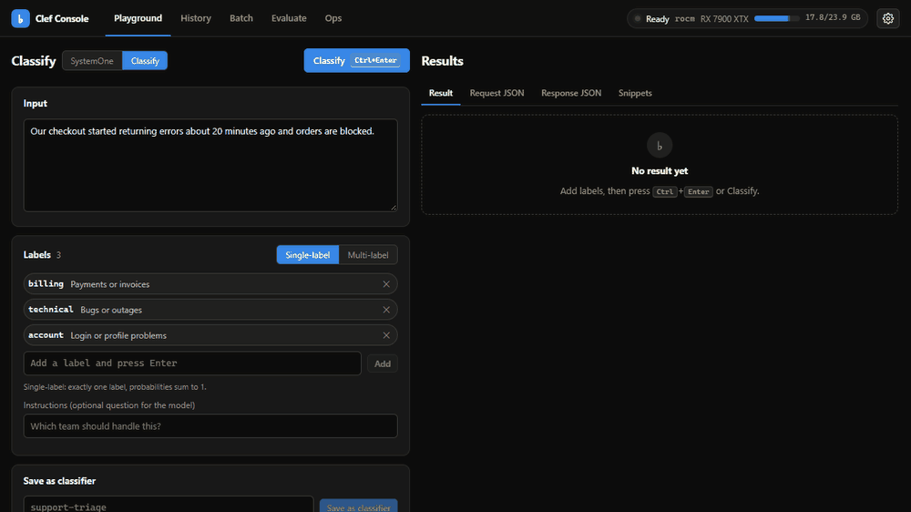

<div class="hero" markdown>

# clef

<p class="tagline">
Run Cloudflare's <a href="https://huggingface.co/Cloudflare/clef-flash">clef-flash</a> decision model locally. Give it an input and a
set of options, get a <strong>calibrated probability for every option in one forward pass</strong>. No text generation, no parsing.
</p>

[Get started](getting-started.md){ .md-button .md-button--primary }
[HTTP API](api-reference.md){ .md-button }
[GitHub](https://github.com/MiguelCarrascoB/clef){ .md-button }

</div>



=== "Python"

    ```python
    from clef_client import ClefClient

    ClefClient().classify("Checkout is down", ["billing", "technical"])
    # -> label='technical' confidence=0.96 scores={'billing': 0.04, 'technical': 0.96}
    ```

=== "curl"

    ```bash
    curl -s http://127.0.0.1:8910/v1/classify -H 'Content-Type: application/json' \
      -d '{"input": "Checkout is down", "labels": ["billing", "technical"]}'
    # {"label":"technical","confidence":0.96,"scores":{"billing":0.04,"technical":0.96}, ...}
    ```

=== "OpenAI SDK"

    ```python
    from openai import OpenAI

    client = OpenAI(base_url="http://127.0.0.1:8910/v1", api_key="not-needed")
    schema = {
        "type": "object",
        "properties": {
            "team": {"type": "string", "enum": ["billing", "technical", "account"]},
            "outage": {"type": "boolean"},
        },
    }
    r = client.chat.completions.create(
        model="clef-flash",
        messages=[{"role": "user", "content": "Checkout is down, orders blocked"}],
        response_format={"type": "json_schema", "json_schema": {"name": "triage", "schema": schema}},
    )
    print(r.choices[0].message.content)  # {"team": "technical", "outage": true}
    ```

=== "JavaScript"

    ```js
    import { ClefClient } from "./clients/js/src/index.js";

    const c = new ClefClient({ baseUrl: "http://127.0.0.1:8910" });
    const r = await c.classify("Checkout is down", ["billing", "technical"]);
    console.log(r.label, r.confidence, r.scores);
    ```

The model is Cloudflare clef-flash: a 9B multimodal decision model (Qwen3.5-9B backbone plus a joint schema head). clef
wraps it in a FastAPI server, a CLI, Python and JavaScript clients and a web console. It reads text, JSON, images and
videos, runs on NVIDIA (CUDA), AMD (ROCm, also under WSL2), Apple Silicon (MPS) and CPU.

## What you get

<div class="grid cards" markdown>

-   :material-tag-multiple-outline: **Classification in one call**

    ---

    `POST /v1/classify` with labels returns a probability per label. Multi-label, scoring and saved classifiers included.

    [:octicons-arrow-right-24: Classification guide](classification.md)

-   :material-swap-horizontal: **OpenAI and Hugging Face compatible**

    ---

    The official OpenAI SDK (structured outputs) and Hugging Face zero-shot clients work against your own machine.

    [:octicons-arrow-right-24: Compatibility](openai-compat.md)

-   :material-chart-line: **Evaluation and calibration**

    ---

    Accuracy, F1, a confusion matrix and calibration for your own labelled data, plus a threshold curve for auto-routing. In the API and in the console.

    [:octicons-arrow-right-24: Evaluation](evaluation.md)

-   :material-clock-outline: **Async jobs and webhooks**

    ---

    Submit up to 100,000 rows, poll or get a signed webhook, and stream the results as JSON, NDJSON or CSV.

    [:octicons-arrow-right-24: Jobs & webhooks](jobs.md)

-   :material-memory: **Smaller GPUs**

    ---

    CPU offload and int8 for 16, 12 and 8 GB cards, with measured latency and accuracy.

    [:octicons-arrow-right-24: Smaller GPUs](memory.md)

-   :material-lan-connect: **Safe remote access**

    ---

    Named API keys, rate limits, CORS and a TLS reverse proxy example.

    [:octicons-arrow-right-24: Remote access](remote-access.md)

</div>

## Console

`http://127.0.0.1:8910/` serves the Clef Console: Playground, History, Batch runs, Evaluate and live Ops charts.


<div class="grid" markdown>


</div>

## Support matrix

| Platform | Backend | Status |
| --- | --- | --- |
| Windows + WSL2, AMD RX 7900 XTX | ROCm 7.2 | **verified** (development machine, all tests + benchmarks) |
| Ubuntu / Windows + WSL2, NVIDIA | CUDA | **untested on hardware** (code paths unit-tested with mocked backends) |
| macOS, Apple Silicon | MPS | **untested on hardware** (no Apple Silicon machine has run it yet) |
| Any OS, no GPU | CPU | **unit-tested** on Ubuntu, macOS and Windows (the tests never load the model) |

"Untested on hardware" becomes "verified" only after a maintainer runs the [hardware validation](hardware-validation.md)
and pastes the result into [hardware results](hardware-results.md).

## Quick links

<div class="grid cards" markdown>

-   :material-rocket-launch-outline: [Install](getting-started.md)
-   :material-console: [CLI reference](cli.md)
-   :material-cog-outline: [Configuration](configuration.md)
-   :material-api: [HTTP API (interactive)](api-reference.md)
-   :material-speedometer: [Performance](performance.md)
-   :material-shield-lock-outline: [Security policy](security.md)
-   :material-lifebuoy: [Troubleshooting](troubleshooting.md)

</div>
