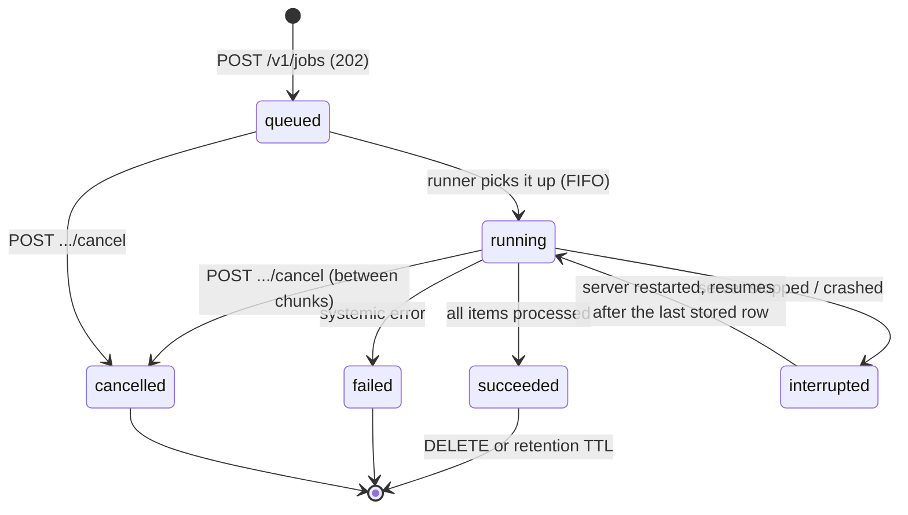

# Async jobs and webhooks

`/v1/classify/batch` holds one HTTP connection open until every record is done. That is fine for 64 rows
and wrong for a 50 000-row CSV (~150 ms per record means about two hours). A **job** is the same work
with the connection closed: submit it, get an id back immediately, then poll (or receive a webhook) and
page or stream the results when it is done.



Interactive requests (`/v1/classify`, `/v1/systemone`, ...) stay responsive while a job runs: the runner
processes one job at a time and keeps **one chunk** (`CLEF_MAX_MICROBATCH` records, 8 by default) in flight
at the engine. A request arriving mid-job waits for the chunk being computed (at most one micro-batch) and is
then served ahead of the job's next chunk. Cancellation also takes effect between chunks.

## Endpoints

All under `/v1`, same API key rules as the rest. Errors are `{detail, request_id}`.

| Method and path | Purpose |
| --- | --- |
| `POST /v1/jobs` | Submit. `202` with the job and a `Location` header. Rate limited like inference. |
| `GET /v1/jobs?status=&kind=&limit=&offset=` | List, newest first (`limit` 1-200, default 50). |
| `GET /v1/jobs/{id}` | Status, progress, ETA, timings, error, result summary, webhook delivery status. |
| `GET /v1/jobs/{id}/results?offset=0&limit=100` | One JSON page (`limit` up to 1000). Follow `next_offset` until it is `null`. |
| `GET /v1/jobs/{id}/results?format=ndjson` or `csv` | Stream every row (`offset` / `limit` optional). Works while the job runs (partial). |
| `POST /v1/jobs/{id}/cancel` | Cancel a queued or running job (`409` if already finished). Rows already produced are kept. |
| `DELETE /v1/jobs/{id}` | Remove a finished job and its rows (`409` while queued / running: cancel first). |

### Submit

```json
{
  "kind": "classify",
  "payload": {"inputs": ["Checkout is down", "Charged twice"], "labels": ["billing", "technical"]},
  "webhook": {"url": "https://hooks.example.com/clef", "secret": "s3cret", "events": ["job.succeeded", "job.failed"]},
  "metadata": {"batch": "2026-10-03"}
}
```

`webhook` and `metadata` are optional (`metadata` is any JSON up to 16 KB, echoed back on every read). The
payload is validated completely at submit time: a mistake is a `400` with a path, for example
`payload.inputs: inputs must contain at least one item` or `payload.requests[12].questions: at least one question is required`,
and nothing is queued.

Built-in kinds:

| `kind` | `payload` | Result rows |
| --- | --- | --- |
| `classify` | `inputs` (up to `CLEF_MAX_JOB_ITEMS`), either `labels` or `classifier` (a saved classify classifier), optional `instructions`, `multi_label`, `threshold`, `model` | `{index, label, confidence, scores, input_tokens}` (multi-label: `labels`, `threshold` instead of `label`, `confidence`) |
| `score` | `inputs`, either `levels` or `classifier` (a saved score classifier), optional `instructions`, `model` | `{index, score, level, level_index, confidence, distribution, input_tokens}` |
| `systemone` | `requests`: a list of `/v1/systemone` bodies (media allowed, same per-request limits) | `{index, model, answers, input_tokens}` |

Other kinds can be registered by feature modules (for example an evaluation job); `POST` with an unknown
kind answers `400` and lists the available ones. A saved classifier is read when the job **starts**, not at
submit.

A row the engine rejects (for example one record over `CLEF_MAX_TOKENS`) does **not** fail the job: its row is
`{"index": 17, "error": "input is too long ..."}`, `progress.failed` counts it, and the rest of the chunk is
processed normally. A job fails only on systemic errors (the engine crashed, or stayed unavailable for
`CLEF_JOB_ENGINE_WAIT_S`). While the model is still loading a job waits and retries; it does not fail.

### Job object

```json
{
  "id": "job_3f9c1e7a5b2d4c60e8a1",
  "kind": "classify",
  "status": "running",
  "progress": {"done": 12000, "total": 50000, "failed": 3, "percent": 24.0},
  "eta_s": 4560.2, "items_per_s": 8.33,
  "created_at": "2026-10-03T09:00:00Z", "started_at": "2026-10-03T09:00:01Z", "finished_at": null,
  "queued_s": 1.1, "duration_s": 1440.0,
  "cancel_requested": false, "resumes": 0, "error": null,
  "result": null,
  "metadata": {"batch": "2026-10-03"},
  "webhook": {"url": "https://hooks.example.com/clef", "events": ["job.succeeded"], "has_secret": true,
              "deliveries": {"job.succeeded": {"id": "...", "status": "pending", "attempts": 0}}}
}
```

`result` is set when the job succeeds (classify: `{items, ok, errors, by_label}`, with `by_labels` for
multi-label; score: `by_level`). `eta_s` and `items_per_s` are measured on the current run. The webhook secret
is never returned; `deliveries.<event>.status` is `pending`, `delivered` or `failed` (with `attempts`,
`last_status` and `last_error`).

## Examples

### curl

```bash
# submit (50k rows would go in "inputs"; raise CLEF_MAX_BODY_MB if the JSON is larger than 64 MB)
curl -sS -i http://127.0.0.1:8910/v1/jobs -H 'X-API-Key: ...' -H 'Content-Type: application/json' -d '{
  "kind": "classify",
  "payload": {"inputs": ["Checkout is down", "Charged twice"], "labels": ["billing", "technical"]}
}'
# poll
curl -sS http://127.0.0.1:8910/v1/jobs/job_3f9c1e7a5b2d4c60e8a1 -H 'X-API-Key: ...'
# results: first page as JSON, or the whole thing as a CSV file
curl -sS 'http://127.0.0.1:8910/v1/jobs/job_3f9c1e7a5b2d4c60e8a1/results?limit=100' -H 'X-API-Key: ...'
curl -sS -o results.csv 'http://127.0.0.1:8910/v1/jobs/job_3f9c1e7a5b2d4c60e8a1/results?format=csv' -H 'X-API-Key: ...'
```

CSV columns are the flattened row (`index`, `label`, `confidence`, `scores.billing`, ...) and `error` last;
`labels` lists are joined with `|`. Row `index` is the position of the input, so you can join back to your data.

### Python

```python
from clef_client import ClefClient

with ClefClient() as clef:
    job = clef.classify_job(texts, ["billing", "technical", "account"])  # returns at once
    job = clef.wait_job(job.id, poll=2, on_progress=lambda j: print(j.status, j.done, j.total))
    if not job.ok:
        raise SystemExit(job.error)
    for item in clef.job_results(job.id):  # pages of 500, in input order
        print(item.index, item.error or item.result.label)
    clef.save_job_results(job.id, "results.csv", format="csv")  # or stream straight to disk
```

`AsyncClefClient` has the same methods (`await`, and `async for` over `job_results`). Other methods:
`submit_job(kind, payload, webhook=..., metadata=...)`, `job(id)`, `jobs(status=...)`, `cancel_job(id)`,
`delete_job(id)`. `wait_job` raises `TimeoutError` when `timeout=` passes; the job keeps running. See
`examples/jobs.py` for a CSV in, CSV out script.

### JavaScript

```js
import { ClefClient } from './clients/js/src/index.js';

const clef = new ClefClient();
let job = await clef.classifyJob(texts, ['billing', 'technical', 'account']);
job = await clef.waitJob(job.id, { pollMs: 2000, onProgress: (j) => console.log(j.status, j.done, j.total) });
if (!job.ok) throw new Error(job.error);
for await (const item of clef.jobResults(job.id)) console.log(item.index, item.error ?? item.result.label);
```

## Webhooks

Instead of polling, pass `webhook: {url, secret?, events?}` when submitting. clef POSTs a JSON event when the
job reaches a final state:

| Event | When |
| --- | --- |
| `job.succeeded`, `job.failed`, `job.cancelled` | the job ended (these three are the default) |
| `job.progress` | opt-in; at most one every 10 s, one attempt, never retried |

```json
{"event": "job.succeeded", "delivery_id": "9b1f...", "created_at": "2026-10-03T10:00:00Z", "job": { ...the job object... }}
```

The body carries the job object (status, progress, `result` summary), not the result rows; fetch those with
the API. Headers: `X-Clef-Event`, `X-Clef-Delivery` (stable across retries, use it to de-duplicate), and, when
the webhook has a `secret`, `X-Clef-Timestamp` (unix seconds) and `X-Clef-Signature: sha256=<hex>` where the
hex value is the HMAC-SHA256 of `"<timestamp>.<raw body>"` keyed with the secret. The signature is recomputed
per attempt, so the timestamp is fresh each time.

**Delivery.** Any 2xx is success. 408, 425, 429, 5xx and network errors are retried with exponential backoff
(about 2, 4, 8, 16 s; `CLEF_WEBHOOK_ATTEMPTS`, default 5 attempts in total); other 4xx and every 3xx are final
(redirects are never followed). Each attempt has a `CLEF_WEBHOOK_TIMEOUT_S` (default 10) total timeout. A
pending delivery survives a server restart and is retried on the next start. Status is in
`GET /v1/jobs/{id}` under `webhook.deliveries`. Webhooks are at-least-once: de-duplicate on `X-Clef-Delivery`.

### Verify on the receiving side

```python
import hashlib, hmac, time


def verify(secret: str, headers, raw_body: bytes, tolerance_s: int = 300) -> bool:
    """headers: any case-insensitive mapping (Flask / FastAPI / requests headers). raw_body: bytes as received."""
    ts = headers["X-Clef-Timestamp"]
    if abs(time.time() - int(ts)) > tolerance_s:  # replay protection
        return False
    expected = (
        "sha256=" + hmac.new(secret.encode(), ts.encode() + b"." + raw_body, hashlib.sha256).hexdigest()
    )
    return hmac.compare_digest(expected, headers["X-Clef-Signature"])
```

Always compute over the raw bytes (not a re-serialised JSON object), reject a missing signature when you
configured a secret, and answer `2xx` quickly (do the work asynchronously).

### Webhooks are off by default (SSRF)

A webhook makes the server send a request to an address chosen by the API caller. So the feature is **disabled
until the operator sets `CLEF_WEBHOOK_ALLOW`** to a comma-separated list of what may be called:

```bash
CLEF_WEBHOOK_ALLOW='hooks.example.com,*.corp.example.net,192.168.1.0/24'
```

* A hostname must be listed exactly (`hooks.example.com`) or by suffix (`*.corp.example.net`). A URL whose
  host is an IP literal must fall inside a listed IP or CIDR.
* Checked at submit (`400` with `webhook.url: ...`) **and again on every delivery attempt**: the hostname is
  resolved right then, **every** returned address must be public or inside a listed IP / CIDR, and the request
  is sent to that checked address (Host header and TLS server name keep the hostname). A DNS answer that
  changes between attempts (DNS rebinding) is therefore refused.
* A private or loopback receiver (for example `192.168.1.20`, or `127.0.0.1` for a local script) must be listed
  by IP or CIDR; listing only its hostname is not enough. Link-local (169.254.0.0/16, which includes cloud
  metadata endpoints), multicast, unspecified and reserved addresses are refused even if a CIDR would cover them.
* Only `http` / `https`, no credentials in the URL, no redirects, no proxy settings from the environment, and an
  API key is never sent. Use `https` for anything that leaves your machine.
* Secrets are stored in the job database (`jobs.db` in the state directory) in clear text, because HMAC needs
  them; protect that directory like the API keys file. The secret is write-only through the API.

## Limits, ownership, retention

| Setting | Default | Meaning |
| --- | --- | --- |
| `CLEF_MAX_JOB_ITEMS` | 100000 | Items per job (`classify`, `score` inputs / `systemone` requests). |
| `CLEF_MAX_JOBS` | 100 | Queued + running jobs; more is `409` with `Retry-After`. |
| `CLEF_JOB_TTL_HOURS` | 168 | Finished jobs (and their rows) are purged this long after they finish; `0` keeps them forever. |
| `CLEF_JOB_ENGINE_WAIT_S` | 600 | How long a job waits for an unavailable engine before failing. |
| `CLEF_WEBHOOK_ALLOW` | empty | Allowed webhook hosts / IPs / CIDRs; empty disables webhooks. |
| `CLEF_WEBHOOK_TIMEOUT_S` | 10 | Total timeout of one delivery attempt. |
| `CLEF_WEBHOOK_ATTEMPTS` | 5 | Delivery attempts for final events. |

The request body limit (`CLEF_MAX_BODY_MB`, default 64) applies to `POST /v1/jobs`: roughly 100 000 short
texts fit, 50 000 long ones may not. Media in `systemone` jobs counts too. Per-record limits (labels, images,
tokens) are the same as for the synchronous endpoints.

**Ownership.** With auth off, every caller sees every job. With `CLEF_API_KEY` / `CLEF_API_KEYS` on, a job is
owned by the key name that submitted it (`default` for `CLEF_API_KEY`); other keys get `404` for it (not `403`)
and do not see it in `GET /v1/jobs`. There is no admin view: stop the server and read `jobs.db` if you need
one. Jobs submitted while auth was off stay visible to all keys after you turn it on. Webhook URLs and
metadata are visible to the owner.

**Persistence and restart.** Jobs and result rows live in SQLite (`<state dir>/jobs.db`) and survive restarts.
Rows are written after every chunk. If the server stops while a job runs it is marked `interrupted` and, on the
next start, **resumed** from the last stored row (`resumes` counts how often), ahead of queued jobs. The three
built-in kinds resume exactly; a custom kind that does not declare itself resumable restarts from item 0.
Resuming re-reads the stored payload, so a saved classifier edited in between is picked up. Delete the file to
drop all jobs.

**Throughput.** Jobs run one at a time, FIFO, at the engine's batch speed (roughly 8-9 records/s on one GPU),
shared with interactive traffic. Priority between jobs, and a priority lane inside the engine, do not exist.

## Writing a job kind

A feature module registers `{"validate": fn, "run": async_fn}` in `ctx.extra["job_kinds"]` (use `setdefault`):

```python
def validate(payload: dict) -> Parsed: ...      # raise ValueError -> 400 at submit; return the parsed object

async def run(ctx, parsed, job) -> dict | None:
    job.set_total(len(parsed.items))
    for chunk in chunks(parsed.items, 8):
        if job.cancelled:
            return None
        await job.add_items([{"index": ..., ...}, ...])   # persist rows in order; progress += len(rows)
    return {"summary": "stored as job.result"}
```

Rows containing an `"error"` key count as failed. Call the model with `ctx.decide(requests, batch=True)`, keep one
call in flight, and check `job.cancelled` between calls. Add `"resumable": True` only if `run` honours
`job.resume_from` (the number of rows already stored) and does not re-emit them.
